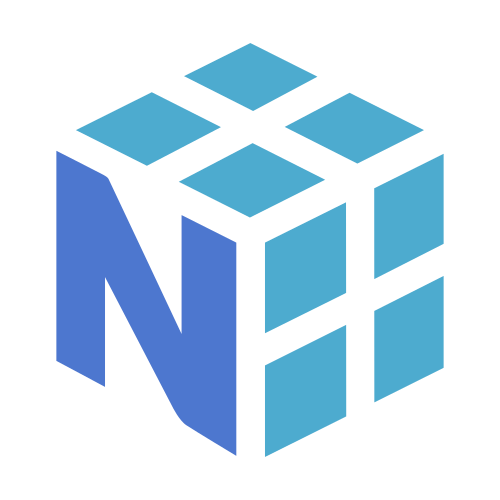

# Adam Di Re | 

## About

Welcome to my portfolio. Listed are a variety of different projects (big and small) that I have worked on over the last few years! Feel free to check out my  for more details on my professional experience!

## Education

### **2019-2023** | Bachelor of Engineering, Software Engineering [@McGill University](https://www.mcgill.ca/),

**Grade: 3.96/4.00**

### **2017-2019** | Diploma of College Studies in Computer Sciences and Mathematics [@Collège Bois-de-Boulogne](https://www.bdeb.qc.ca/)

## Projects

### 2023 | Barbell Tracker | Health and Fitness <!--| [Repository](https://github.com/AdamMigliore/BarbellTracker) -->

 
This project was created to help me track the barbell path when I perform a Squat, Bench Press and Deadlift. A weightlifter can optimize their barbell path to maximize the efficiency of their lift. To analyze the bar path, I used YOLOv8 by Ultralytics to train a model capable of detecting a barbell in real-time. I then use OpenCV to track the center of the barbell. The video of the lift is exported in `.mp4` format with the traced bar path. I also compute the barbell's velocity, change in position and angle for every frame. This allows the weightlifter to leverage velocity based training techniques.

#### Technologies

### 2023 | Weight Tracker Tool | Health and Fitness | [Repository](https://github.com/AdamMigliore/weight-analysis)

This project is used by myself daily to track my weight. I created visualizations using [Recharts](https://recharts.org/en-US/) for my weight, body fat and calories data. I also have a chart for the median week-to-week weight fluctuation which is better suited to view weight change directions over time. Finally, I implemented my own algorithm to estimate my average caloric intake based on the data I gathered. This project is a hosted locally on a Ubuntu server.

#### Technologies

### 2022-2023 | Urbengage | Capstone Design Project

This project was a research project done under the advisor of Prof. Nik Luka from [Peter Guo-hua Fu School of Architecure](https://www.mcgill.ca/architecture/) at [McGill University](https://www.mcgill.ca/). Our team researched the components which facilitate urban planners in gathering citizen feedback on urban initiatives. We successfully proved that our solution could help urban planners reduce 10x their costs and save them 200+ manhours. We created an engaging surveying experience for citizens, we automated data analysis and visualization and we optimized mobilization campaigns. This project was a success all while coming under a third of the allocated budget.

#### Technologies

### 2022 | Espresso Tracker Backend | [Repository](https://github.com/AdamMigliore/ECSE437_Final_Project)

As part of our final project for the [ECSE437](https://www.mcgill.ca/study/2022-2023/courses/ecse-437) course at McGill University, our team had to integrate the different DevOps processes we learned throughout the semester. Our team created a REST API using [Express.js](https://expressjs.com/) for our MySQL database. We incorporated automated testing using [Jest](https://jestjs.io/), linting using [ESLint](https://eslint.org/) and source code management using [Git](https://git-scm.com/). We used [Github Actions](https://github.com/features/actions) for our CI system. We went above the requirements for the project and added CD using [Railway](https://railway.app/). **Grade: 105%**

#### Technologies

### 2022 | Health Data Parser | Health and Fitness

This tool allows a user to scrape their data from MyFitnessPal, analyze their Apple Health data and analyze their weight data provided by Renpho. First, it creates a snapshot of the daily activity of the user using Apple Health. Second, it scrapes the last 365 days of calories consumed from MyFitnessPal. Third, it merges all the data by day to create a daily snapshot of activity, calories consumed and weight and body fat. Finally, the tool filters the data to remove outliers and estimates the user's TDEE (total daily energy expenditure). The tool scrapes the data using a multi threaded approach and streams the XML data for faster analysis.

#### Technologies

### 2021 | SMKE Token | Finance | [Repository](https://github.com/AdamMigliore/SmokeToken) | [Website](friendly-cray-c9d4b7.netlify.app)

I created an ERC-20 smart contract based on [OpenZeppelin's](https://www.openzeppelin.com/) standard. I enhanced the smart contract to have a extra features such as spreading your token's to all holders and receiving tokens on Wednesday's. I wrote an oracle and a web application to interact with the smart contract. The smart contract is deployed on the Rinkeby test network.

#### Technologies

### 2020 | Real Estate Analysis Tool

This project is a web application built with React and Material UI for the frontend and Node.js, [Express.js](https://expressjs.com/) and [Passport.js](https://www.passportjs.org/) for the backend. The application allows a user to automatically analyze a real estate property. The application provides an analysis of the property and stores it for further viewing. I use Express.js to create the REST API and Passport.js for authentication. For the analysis, I implemented a financial library. Some of the financial calculations performed are the NPV, IRR, MIRR, mortgage calculations and operating costs with inflation over time. I implemented unit and integration tests using [Jest](https://jestjs.io/), [Superagent](https://ladjs.github.io/superagent/) and [Postman](https://www.postman.com/).

#### Technologies

## Other Tools and Languages

<!-- ## GitHub Stats

 -->
