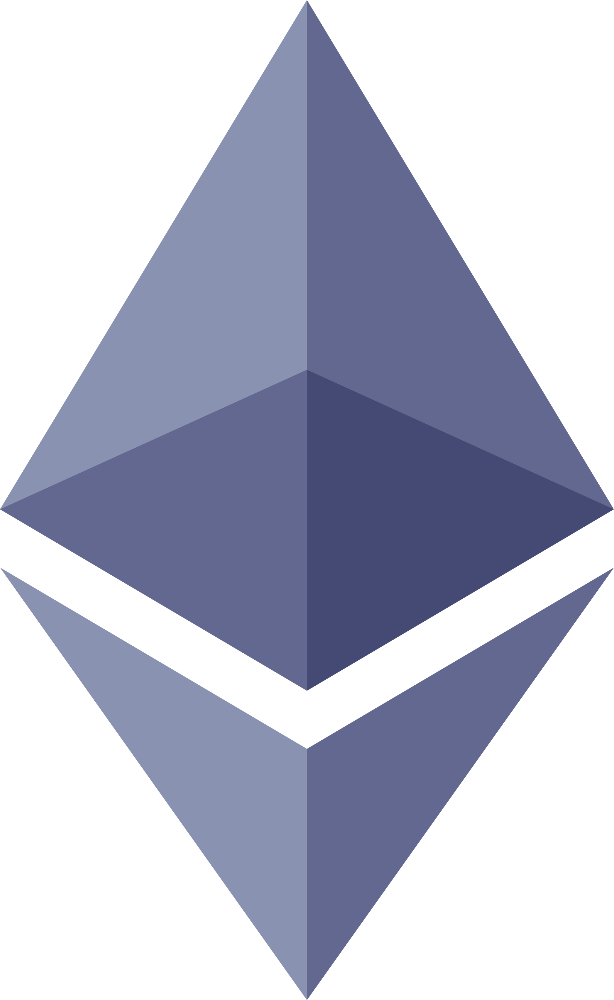

# Adam Di Re | 
## About
Welcome to my portfolio. Listed are a variety of different projects (big and small) that I have worked on over the last few years! Feel free to check out my  for more details on my professional experience!

## Education
### __2019-2023__ | Bachelor of Engineering, Software Engineering [@McGill University](https://www.mcgill.ca/), 
**Grade: 3.95/4.00**
### __2017-2019__ | Diploma of College Studies in Computer Sciences and Mathematics [@Collège Bois-de-Boulogne](https://www.bdeb.qc.ca/)

## Projects
### 2023 | Weight Tracker Tool | Health and Fitness | [Repository](https://github.com/AdamMigliore/weight-analysis)

This project is used by myself daily to track my weight. I created visualizations using [Recharts](https://recharts.org/en-US/) for my weight, body fat and calories data. I also have a chart for the median week-to-week weight fluctuation which is better suited to view weight change directions over time. Finally, I implemented my own algorithm to estimate my average caloric intake based on the data I gathered. This project is a hosted locally on a Ubuntu server.

#### Technologies

<!--
### 2022 | Computer Vision Projects | 

#### Technologies
Python
Jupyter Notebook
OpenCV
Numpy
-->

### 2022 | Espresso Tracker Backend | [Repository](https://github.com/AdamMigliore/ECSE437_Final_Project)
As part of our final project for the [ECSE437](https://www.mcgill.ca/study/2022-2023/courses/ecse-437) course at McGill University, our team had to integrate the different DevOps processes we learned throughout the semester. Our team created a REST API using [Express.js](https://expressjs.com/) for our MySQL database. We incorporated automated testing using [Jest](https://jestjs.io/), linting using [ESLint](https://eslint.org/) and source code management using [Git](https://git-scm.com/). We used [Github Actions](https://github.com/features/actions) for our CI system. We went above the requirements for the project and added CD using [Railway](https://railway.app/). **Grade: 105%**

#### Technologies

### 2022-2023 | Urbengage | Capstone Design Project
This project was a research project done under the advisor of Prof. Nik Luka from [Peter Guo-hua Fu School of Architecure](https://www.mcgill.ca/architecture/) at [McGill University](https://www.mcgill.ca/). Our team researched the components which facilitate urban planners in gathering citizen feedback on urban initiatives. We successfully proved that our solution could help urban planners reduce 10x their costs and save them 200+ manhours. We created an engaging surveying experience for citizens, we automated data analysis and visualization and we optimized mobilization campaigns. This project was a success all while coming under a third of the allocated budget.

#### Technologies

### 2021 | SMKE Token | Finance | [Repository](https://github.com/AdamMigliore/SmokeToken) | [Website](friendly-cray-c9d4b7.netlify.app)
I created an ERC-20 smart contract based on [OpenZeppelin's](https://www.openzeppelin.com/) standard. I enhanced the smart contract to have a extra features such as spreading your token's to all holders and receiving tokens on Wednesday's. I wrote an oracle and a web application to interact with the smart contract. The smart contract is deployed on the Rinkeby test network.

#### Technologies

<!-- ## GitHub Stats
 -->
